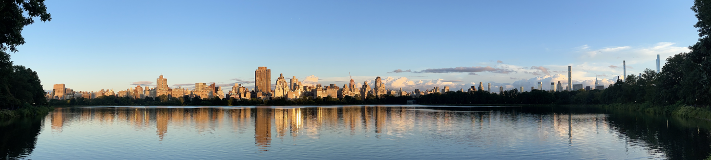

<figure style="float: left; margin: -5px 0 -5px 0;">
    
</figure>
Based within [the Department of Environmental Health Sciences](http://www.mailman.columbia.edu/academic-departments/environmental-health-sciences) at [Mailman School of Public Health](https://www.mailman.columbia.edu/), Columbia University, our group studies the environmental, social, and ecological determinants of infectious diseases using mathematical and statistical techniques. We develop mathematical models and computational tools to advance surveillance, forecasting, and control of both seasonal and emerging infectious agents, with a focus on respiratory viruses and antimicrobial-resistant pathogens. We also apply methods in complex systems and network science to address broad scientific questions in health.

Real-time forecasts for respiratory diseases
======
For the 2023-2024 season, we are generating weekly real-time forecasts for hospitalizations caused by influenza, COVID-19, and RSV at the US state level. Forecasts can be downloaded from our [GitHub repository](https://github.com/tkcy/projections2023_2024). Visualizations of forecasts can be found [here](https://msph.shinyapps.io/CFRH/).

Latest News
======

- **09/03/2024** We have a few members joining our group in fall 2024. Dr. Tory Lynch joins our group as a T32 Postdoctoral Fellow (co-supervised by Prof. Robbie Parks and Prof. Sen Pei). Christine Kuryla joins us as a second-year PhD student in EHS (co-supervised by Prof. Alan Cohen and Prof. Sen Pei). Fin Mooney is a new PhD student in EHS doing rotation in our group. We also have several master students from EHS and Biostatistics conducting their practicums in our group. Welcome new members!

- **08/01/2024** I am appointed the director of the [Environmental Health Data Science MS Program](https://www.publichealth.columbia.edu/academics/degrees/master-science/environmental-health-data-science) in EHS department, Columbia University.

- **06/18/2024** I and Dr. Qing Yao attended NetSci 2024 in Quebec City, Canada. I presented our work on behavior-driven forecasts of neigbhorhood-level COVID-19 spread in New York City. Dr. Yao presented our study on superspreading and spatial spread of infectious diseases.

- **01/11/2024** I joined the Data Science for Public Health Summit held at Columbia Mailman School of Public Health. I presented on data challenges in AI/ML for climate change and infectious disease research and participated in the panel discussion on AI/ML for climate and health.

- **12/01/2023** Our R21 project entitled "Inference of heterogeneous transmission of antimicrobial resistant pathogens in health care settings" is awarded by NIAID.

- **11/28/2023** I and Dr. Qing Yao attended [EPIDEMICS 9 - 9th International Conference on Infectious Disease Dynamics](https://www.elsevier.com/events/conferences/all/international-conference-on-infectious-disease-dynamics). I presented "Inference of asymptomatic carriers of antimicrobial-resistant organisms in healthcare settings using multitype observations" in the AMR session. Dr. Qing Yao presented a poster on superspreading and spatial spread. I chaired the COVID-19 session.

- **11/14/2023** I attended the [Transatlantic Taskforce on Antimicrobial Resistance (TATFAR)](https://www.cdc.gov/drugresistance/tatfar/index.html) in-person meeting in Luxembourg and presented our research on AMR surveillance in hospital settings.

- **10/30/2023** I and Dr. Qing Yao attended the [MIDAS annual meeting](https://midasnetwork.us/midas-network-annual-meeting-midas-2023/) in Atlanta, GA. Both of us presented our recent works on antimicrobial resistance and superspreading of respiratory diseases.

- **07/12/2023** I attended the [NetSci 2023 conference](https://netsci2023.wixsite.com/netsci2023) at Vienna, Austria and gave a talk "Ensemble inference of unobserved infections in networks using partial observations".

- **05/29/2023** I attended the workshop [Unifying the epidemiological and evolutionary dynamics of pathogens](https://indico.fysik.su.se/event/7915/) at NORDITA (Nordic Institute for Theoretical Physics), Stockholm, Sweden.

- **05/01/2023** I visited the [Vermont Complex Systems Center](https://vermontcomplexsystems.org/) at University of Vermont.

- **04/24/2023** I attended the [Human Behavior and Disease Dynamics](https://brinmrc.umd.edu/programs/workshops/spring23/spring23-workshop-disease.html) workshop hosted by the Brin Mathematics Research Center, University of Maryland.

- **03/01/2023** Welcome [Dr. Qing Yao](https://qing1101.com/) joining our group as a Postdoctoral Research Scientist!