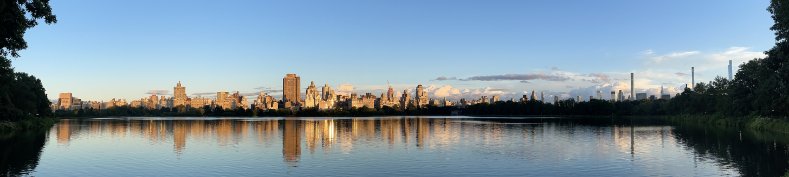

<figure style="float: left; margin: -5px 0 -5px 0;">
    
</figure>
Based within [the Department of Environmental Health Sciences](http://www.mailman.columbia.edu/academic-departments/environmental-health-sciences) at [Mailman School of Public Health](https://www.mailman.columbia.edu/), Columbia University, our group studies the environmental, social, and ecological determinants of infectious diseases using mathematical and statistical techniques. We develop mathematical models and computational tools to advance surveillance, forecasting, and control of both seasonal and emerging infectious agents, with a focus on respiratory viruses and antimicrobial-resistant pathogens. We also apply methods in complex systems and network science to address broad scientific questions in health.

Latest News
======

- **06/01/2026** Our group attended [NetSci 2026 International School & Conference on Network Science](https://www.netsci2026.com/) in Boston.

- **05/18/2026** [Dr. Haogao Gu](https://www.guhaogao.com/) joined our group as an Associate Research Scientist. Dr. Gu has strong expertise in bioinformatic and phylogenetic analysis of viral sequencing data, and is currently exploring how genomic data and infectious disease models can together inform public health preparedness at both the individual and population levels.

- **03/09/2026** I was elected as a [Steering Committee Member](https://midasnetwork.us/about/#steering-committee) of the [MIDAS network](https://midasnetwork.us/).

- **03/02/2026** I visited the Public Health Modeling Unit at Yale School of Public Health and gave a seminar "Pathogen spread as a complex system: Inference and control of antimicrobial-resistant organisms in hospitals".

- **01/06/2026** New paper "[Reconstructing the early spatial spread of pandemic respiratory viruses in the United States](https://www.pnas.org/doi/abs/10.1073/pnas.2518051123)" is published in PNAS.

- **12/01/2025** Our group attended EPIDEMICS 10: 10th International Conference on Infectious Disease Dynamics in San Diego, CA.

- **11/04/2025** Our group attended the 2025 MIDAS Network Annual Meeting in Bethesda, MD.

- **08/21/2025** As the faculty lead of the program "[Unveiling Public Health: A Discovery Tour in China](https://globalcenters.columbia.edu/content-beijing/unveiling-public-health-discovery-tour-china)", I visited eight universities/institutions in Beijing with seven Mailman students and alumni. This immersive Public Health Study Tour is supported by the Scholar-in-Residence program during my residency at Columbia Beijing Center. 

- **08/06/2025** Our R35 MIRA project "Early detection and inference for emerging infectious agents in data-sparse settings" is awarded by NIH/NIGMS.

- **07/20/2025** Our [study](https://iopscience.iop.org/article/10.1088/1748-9326/ae0e39) on adaptive mobility responses during Hurricanes Helene and Milton in 2024 is featured by the Washington Post in the story "[A new era of floods has arrived. America isn’t prepared.](https://www.washingtonpost.com/climate-environment/2025/07/07/hurricane-helene-evacuation-north-carolina-warnings/)".

- **07/14/2025** I attended the Society for Mathematical Biology Annual Meeting 2025 in Edmonton, Canada. I presented a talk "Addressing the challenge of imperfect observation processes in epidemic modeling" in the minisymposium: Scenario Modeling to Inform Public Policymaking.

- **01/13/2025** I am selected as a [2025 Scholar-in-Residence at the Columbia Global Center in Beijing](https://globalcenters.columbia.edu/content/sen-pei). I will visit Columbia Beijing Center in August 2025 to advance climate, health, and infectious disease collaboration in China.

- **09/03/2024** We have a few members joining our group in fall 2024. Dr. Tory Lynch joins our group as a T32 Postdoctoral Fellow (co-supervised by Prof. Robbie Parks and Prof. Sen Pei). Christine Kuryla joins us as a second-year PhD student in EHS (co-supervised by Prof. Alan Cohen and Prof. Sen Pei). Fintan Mooney is a new PhD student in EHS doing rotation in our group. We also have several master students from EHS and Biostatistics conducting their practicums in our group. Welcome new members!

- **08/01/2024** I am appointed the director of the [Environmental Health Data Science MS Program](https://www.publichealth.columbia.edu/academics/degrees/master-science/environmental-health-data-science) in EHS department, Columbia University.

- **06/18/2024** I and Dr. Qing Yao attended NetSci 2024 in Quebec City, Canada. I presented our work on behavior-driven forecasts of neigbhorhood-level COVID-19 spread in New York City. Dr. Yao presented our study on superspreading and spatial spread of infectious diseases.

- **01/11/2024** I joined the Data Science for Public Health Summit held at Columbia Mailman School of Public Health. I presented on data challenges in AI/ML for climate change and infectious disease research and participated in the panel discussion on AI/ML for climate and health.

- **12/01/2023** Our R21 project entitled "Inference of heterogeneous transmission of antimicrobial resistant pathogens in health care settings" is awarded by NIAID.

- **11/28/2023** I and Dr. Qing Yao attended [EPIDEMICS 9 - 9th International Conference on Infectious Disease Dynamics](https://www.elsevier.com/events/conferences/all/international-conference-on-infectious-disease-dynamics). I presented "Inference of asymptomatic carriers of antimicrobial-resistant organisms in healthcare settings using multitype observations" in the AMR session. Dr. Qing Yao presented a poster on superspreading and spatial spread. I chaired the COVID-19 session.

- **11/14/2023** I attended the [Transatlantic Taskforce on Antimicrobial Resistance (TATFAR)](https://www.cdc.gov/drugresistance/tatfar/index.html) in-person meeting in Luxembourg and presented our research on AMR surveillance in hospital settings.

- **10/30/2023** I and Dr. Qing Yao attended the [MIDAS annual meeting](https://midasnetwork.us/midas-network-annual-meeting-midas-2023/) in Atlanta, GA. Both of us presented our recent works on antimicrobial resistance and superspreading of respiratory diseases.

- **07/12/2023** I attended the [NetSci 2023 conference](https://netsci2023.wixsite.com/netsci2023) at Vienna, Austria and gave a talk "Ensemble inference of unobserved infections in networks using partial observations".

- **05/29/2023** I attended the workshop [Unifying the epidemiological and evolutionary dynamics of pathogens](https://indico.fysik.su.se/event/7915/) at NORDITA (Nordic Institute for Theoretical Physics), Stockholm, Sweden.

- **05/01/2023** I visited the [Vermont Complex Systems Center](https://vermontcomplexsystems.org/) at University of Vermont.

- **04/24/2023** I attended the [Human Behavior and Disease Dynamics](https://brinmrc.umd.edu/programs/workshops/spring23/spring23-workshop-disease.html) workshop hosted by the Brin Mathematics Research Center, University of Maryland.

- **03/01/2023** Welcome [Dr. Qing Yao](https://qing1101.com/) joining our group as a Postdoctoral Research Scientist!