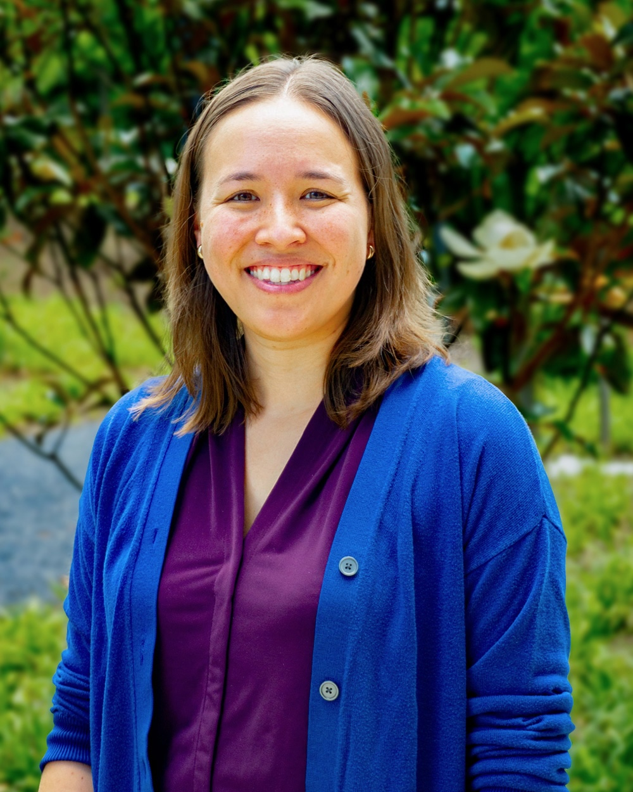
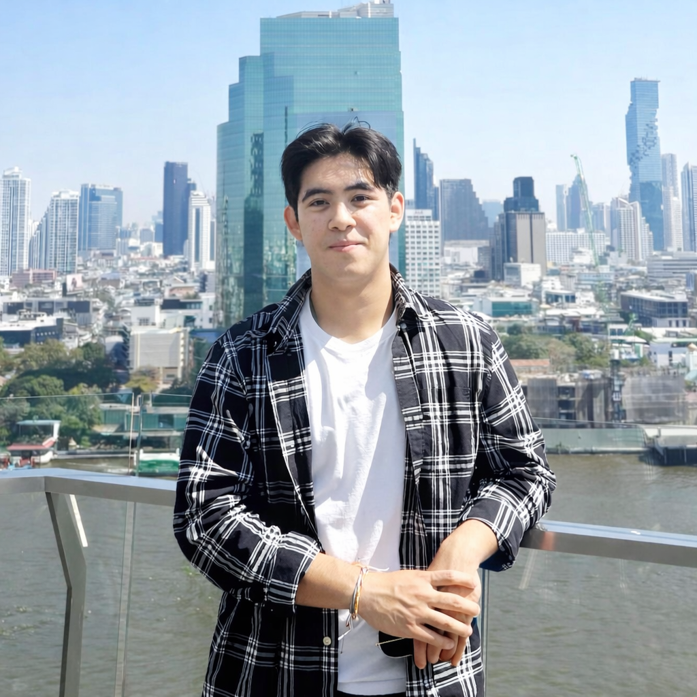



<a href="/talkmap.html">See a map of all the places I've given a talk!</a>



<figure style="float: left; margin: 0 20px -10px 0;">
    
</figure>

## Sen Pei
Dr. Sen Pei is an [Assistant Professor](https://www.publichealth.columbia.edu/profile/sen-pei) in the Department of Environmental Health Sciences at Mailman School of Public Health, Columbia University. With a background in applied mathematics, network science, and complex systems, he studies environmental, social, and ecological determinants of infectious disease, aiming to better understand, predict, and prepare for recurrent and emerging outbreaks. Using a variety of data sources, he develops mathematical models and computational tools to advance surveillance, forecasting, and control of seasonal and emerging infectious agents. His recent studies focus on respiratory viruses and antimicrobial-resistant pathogens in healthcare systems.

<figure style="float: left; margin: 0 20px -10px 0;">
    
</figure>

## [Qing Yao](https://scholar.google.com/citations?user=xjrfQTsAAAAJ&hl=en)
### Associate Research Scientist
Dr. Qing Yao is an associate research scientist with a focus on the theories and application of complexity and network science. She is currently working on modeling infectious diseases spread and understanding the impact of human behaviour on this phenomenon. Prior to her current position, Qing conducted research at Beijing Normal University and Imperial College London. She holds a PhD in physics and a Master's degree in financial statistics.

<figure style="float: left; margin: 0 20px -10px 0;">
    
</figure>

## [Haogao Gu](https://www.guhaogao.com/)
### Associate Research Scientist
Dr. Haogao Gu is an Associate Research Scientist studying virus evolution and the epidemiology of viral infections. He has extensive experience in the bioinformatic and phylogenetic analysis of viral sequencing data, and is currently exploring how genomic data and infectious disease models can together inform public health preparedness at both the individual and population levels. Haogao holds a bachelor's degree in Preventive Medicine and a PhD in Infectious Disease (Bioinformatics). He hopes his interdisciplinary background can contribute to the group's work on surveillance, forecasting, and control of emerging pathogens.

<figure style="float: left; margin: 0 20px -10px 0;">
    
</figure>

## [Maya Chung](https://mayavchung.github.io/)
### Postdoctoral Research Fellow
Dr. Maya Chung is a Postdoctoral Research Scientist at the Columbia Climate School, where she studies the intersections of climate and health. Her research spans climate modeling, physical oceanography, infectious disease, and temperature-related health impacts. She previously held a postdoctoral position at the High Meadows Environmental Institute and holds a PhD in Atmospheric and Oceanic Sciences from Princeton University and a BA in Earth and Planetary Sciences from Harvard University. Maya aims to leverage insights from climate and health data and models to inform public health policymaking in our changing climate.

<figure style="float: left; margin: 0 20px -10px 0;">
    
</figure>

## [Victoria Lynch](https://scholar.google.com/citations?user=4b-RO54AAAAJ&hl=en)
### Postdoctoral Research Fellow
Victoria (Tory) Lynch is a postdoctoral scientist in the Environmental Health Sciences Department at Columbia Mailman School of Public Health, where she also completed her PhD in August 2022. Her doctoral work examined the association between flooding and waterborne infectious diseases with a particular focus on Legionnaires' disease. As a postdoctoral research fellow, she continues to study the effect of extreme events, namely cyclonic storms and large flood events, on a broader range of health outcomes and among vulnerable populations including outdoor workers and people in carceral facilities.

<figure style="float: left; margin: 0 20px -10px 0;">
    
</figure>

## [Christine Kuryla](https://www.researchgate.net/profile/Christine-Kuryla-2)
### Doctoral Student
Christine Kuryla is working on her PhD in the department of Environmental Health Sciences. She holds an MPH from Columbia University, a Pre-medical Post-bac from Johns Hopkins, and a B.S. In Physics with a concentration in Mathematics from FIU. She is interested in using various types of data, including physiological time series, as well as omics, to characterize health states and quantify intrinsic health.

<figure style="float: left; margin: 0 20px -10px 0;">
    
</figure>

## [Fintan Mooney](https://scholar.google.com/citations?user=rIxwb48AAAAJ&hl=en)
### Doctoral Student
Fintan (Fin) Mooney is a PhD student in Environmental Health Sciences at the Columbia Mailman School of Public Health. He holds an MPH in Environmental Health Sciences from Yale and both an M.A. in Community Development and Planning and a B.A. in Psychology with a concentration in Public Health from Clark University. His research focuses on spatial epidemiology and GIS methods, with an emphasis on health risks from fossil fuel infrastructure and climate change. His current work examines environmental determinants of highly pathogenic avian influenza outbreaks, as well as the health effects of evacuation and mobility during extreme weather events.

<figure style="float: left; margin: 0 20px -10px 0;">
    
</figure>

## [Yiming Cao](https://www.linkedin.com/in/yimingcao1124)
### Research Associate
Yiming Cao is a Research Associate at Columbia Mailman School of Public Health. He graduated from the Environmental Health Data Science MS Progam in the Department of Environmental Health Sciences at Columbia Mailman. He holds a B.S. in Statistics from the University of California, Davis. His work focuses on time-series deep learning modeling and the application of LLMs in public health, including the analysis of physiological signals and other health data. He is particularly interested in developing AI-driven tools to improve disease prediction, health risk assessment, and decision-making in public health practice.

<figure style="float: left; margin: 0 20px -10px 0;">
    
</figure>

## [Yuchen Qin](https://www.linkedin.com/in/yuchen-qin-22444632a/)
### Research Associate
Yuchen Qin is a Research Associate in the Department of Environmental Health Sciences at Columbia Mailman School of Public Health. He works on infectious disease modeling and LLM-based epidemic forecasting, with side interests in labor market mobility. He holds a B.S. in Computer Science from USTC (China) and a master's degree from UVA.

<figure style="float: left; margin: 0 20px -10px 0;">
    
</figure>

## [Bohan Zhu](www.linkedin.com/in/bohan-zhu-920910394)
### Master Student
Bohan Zhu is currently a graduate student studying Theory and Method in the Department of Biostatistics at Columbia Mailman School of Public Health. Before entering Columbia, he completed a B.S. in Statistics and a B.A. in Business at the University of Rochester. His interests include time-series modeling, Bayesian methods, and applying quantitative approaches to public health questions. His recent work spans entropy-based time-series change-point detection, clinical risk factor modeling, and the use of regression and machine learning tools for surveillance and analysis.

<figure style="float: left; margin: 0 20px -10px 0;">
    
</figure>

## [Veerapetch Petchger](https://www.linkedin.com/in/vpetchger/)
### Master Student
Veerapetch Petchger is a graduate student pursuing an MS in Biostatistics at the Columbia Mailman School of Public Health. He holds a BS in Public Health Science with a minor in Statistics from the University of Maryland, College Park.  At Columbia, he is working with the Pei Group on a data pipeline to visualize human mobility flows across New York City ZIP codes, with the goal of understanding how populations move in response to environmental and public health events. His broader interests lie in applying statistical modeling and computational tools to infectious disease dynamics and public health preparedness.

<figure style="float: left; margin: 0 20px -10px 0;">
    
</figure>

## [Theodore Lee](https://www.linkedin.com/in/theodore-lee-185787349/)
### MPH Student
Theodore Lee is a graduate student pursuing an MPH in environmental health sciences at the Columbia Mailman School of Public Health. He holds a B.S. in animal science with a minor in infectious disease biology from Cornell University. His interests lie in the relationship between human mobility patterns and spillover events of zoonotic disease, with the goal of developing tools to inform responses against future outbreaks of disease.

<figure style="float: left; margin: 0 20px -10px 0;">
    
</figure>

## [Nidhi Ram](https://www.linkedin.com/in/nidhi-ram-73751a269/)
### Undergraduate
Nidhi Ram is an undergraduate student at Columbia College studying Mathematics and Middle Eastern, South Asian, and African Studies. She is interested in exploring the intersection of math and human rights. In particular, she hopes to apply mathematical modeling and quantitative methods to problems in public health and policy.

<figure style="float: left; margin: 0 20px -10px 0;">
    
</figure>

## [Yuhao Xiao](https://www.linkedin.com/in/yuhao7xiao)
### Undergraduate
Yuhao (Jason) Xiao is an undergraduate student studying Applied Mathematics and Computer Science at Columbia's School of Engineering and Applied Science. His interests include software engineering, machine learning, data analysis, and applying quantitative methods to model human behavior.

<figure style="float: left; margin: 0 20px -10px 0;">
    
</figure>

## [Yifeng Ke](https://www.linkedin.com/in/athena-ke-625b602ab/)
### Undergraduate
Yifeng (Athena) Ke is an undergraduate student at Barnard College studying Applied Mathematics and Statistics. She is interested in quantitative solutions to pressing public and population health concerns. She hopes to explore mathematical and statistical modeling in epidemiology as well as in various biological contexts. 


  

