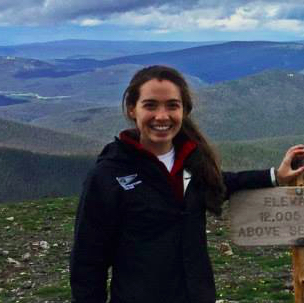
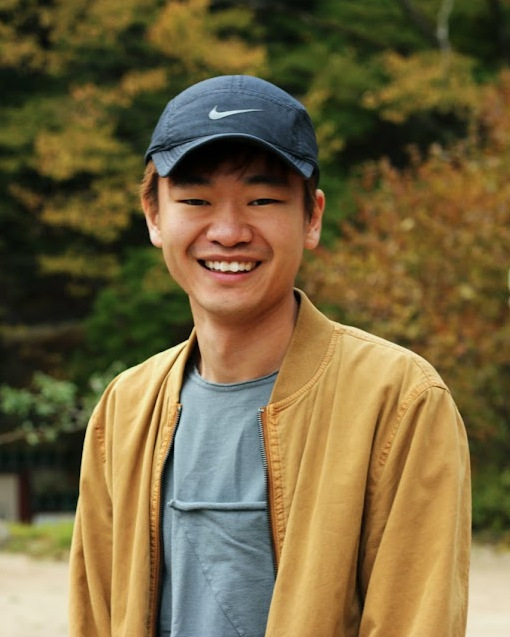
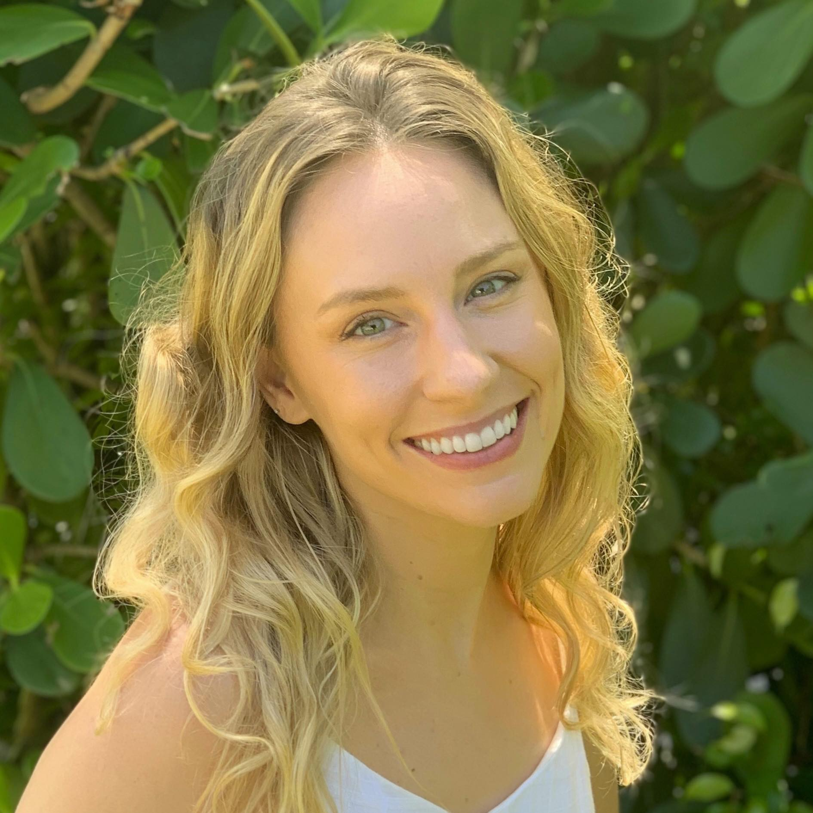
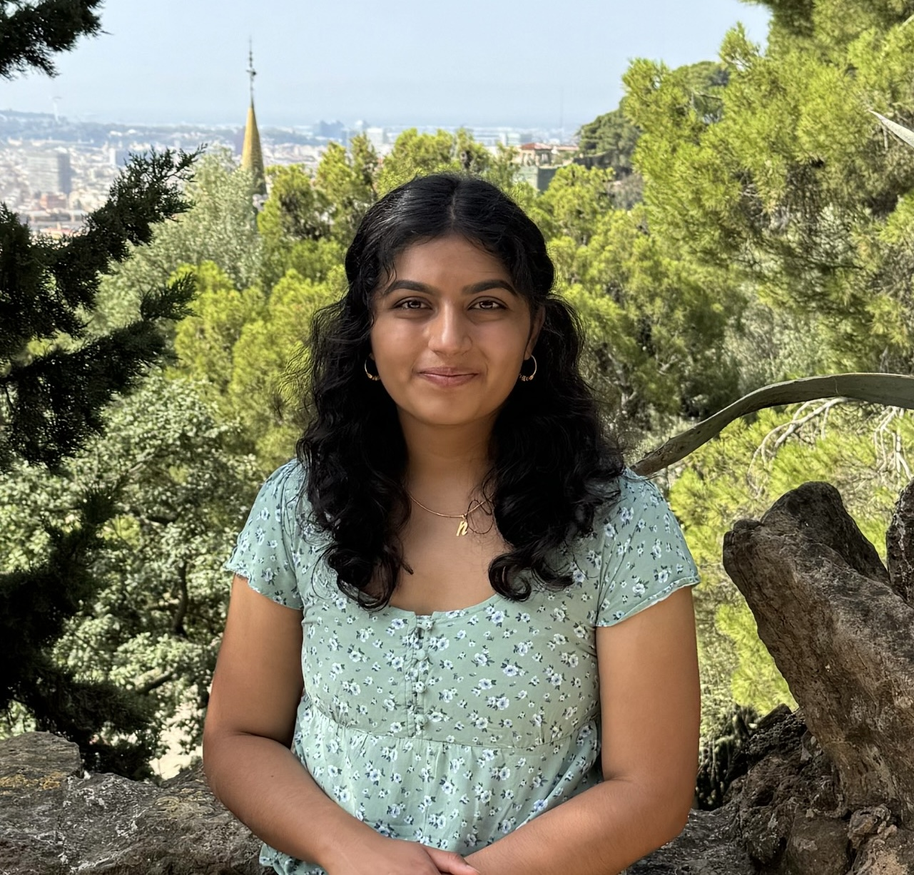



<a href="/talkmap.html">See a map of all the places I've given a talk!</a>



<figure style="float: left; margin: 0 20px -10px 0;">
    
</figure>

## Sen Pei
Dr. Sen Pei is an [Assistant Professor](https://www.publichealth.columbia.edu/profile/sen-pei) in the Department of Environmental Health Sciences at Mailman School of Public Health, Columbia University. With a background in applied mathematics, network science, and complex systems, he studies environmental, social, and ecological determinants of infectious disease, aiming
to better understand, predict, and prepare for recurrent and emerging outbreaks. Using a variety of data sources, he develops mathematical models and computational tools to advance surveillance, forecasting, and control of seasonal and emerging infectious agents. His recent studies focus on respiratory viruses and antimicrobial-resistant pathogens in healthcare systems.

<figure style="float: left; margin: 0 20px -10px 0;">
    
</figure>

## [Qing Yao](https://qing1101.com/)
### Associate Research Scientist
Dr. Qing Yao is an associate research scientist with a focus on the theories and application of complexity and network science. She is currently working on modeling infectious diseases spread and understanding the impact of human behaviour on this phenomenon. Prior to her current position, Qing conducted research at Beijing Normal University and Imperial College London. She holds a PhD in physics and a Master's degree in financial statistics.

<figure style="float: left; margin: 0 20px -10px 0;">
    
</figure>

## [Victoria Lynch](https://scholar.google.com/citations?user=4b-RO54AAAAJ&hl=en)
### Postdoctoral Research Fellow
Victoria (Tory) Lynch is a postdoctoral scientist in the Environmental Health Sciences Department at Columbia Mailman School of Public Health, where she also completed her PhD in August 2022. Her doctoral work examined the association between flooding and waterborne infectious diseases with a particular focus on Legionnaires' disease. As a postdoctoral research fellow, she continues to study the effect of extreme events, namely cyclonic storms and large flood events, on a broader range of health outcomes and among vulnerable populations including outdoor workers and people in carceral facilities.

<figure style="float: left; margin: 0 20px -10px 0;">
    
</figure>

## [Han Yong Wunrow](https://hwunrow.github.io/)
### Doctoral Student
Han Yong Wunrow began his PhD in Applied Mathematics in the fall of 2021. He received an MS in Applied Mathematics from the University of Washington and was a Post-Bachelor Fellow at the Institute for Health Metrics and Evaluation, where he worked on the Global Burden of Disease study and the Future Health Scenarios forecasting team. He is interested in the science of transforming raw health data into actionable information through mathematical modeling and computational science. While at Columbia, he hopes to help solve some of the analytical challenges in combining statistical and mechanistic models of infectious disease dynamics.

<figure style="float: left; margin: 0 20px -10px 0;">
    
</figure>

## [Christine Kuryla](https://www.researchgate.net/profile/Christine-Kuryla-2)
### Doctoral Student
Christine Kuryla is working on her PhD in the department of Environmental Health Sciences. She holds an MPH from Columbia University, a Pre-medical Post-bac from Johns Hopkins, and a B.S. In Physics with a concentration in Mathematics from FIU. She is interested in using various types of data, including physiological time series, as well as omics, to characterize health states and quantify intrinsic health.

<figure style="float: left; margin: 0 20px -10px 0;">
    
</figure>

## [Fintan Mooney](https://scholar.google.com/citations?user=rIxwb48AAAAJ&hl=en)
### Doctoral Student
Fintan (Fin) Mooney is a PhD student in Environmental Health Sciences at the Columbia Mailman School of Public Health. He holds an MPH in Environmental Health Sciences from Yale and both an M.A. in Community Development and Planning and a B.A. in Psychology with a concentration in Public Health from Clark University. His research focuses on spatial epidemiology and GIS methods, with an emphasis on health risks from fossil fuel infrastructure and climate change. His current work examines environmental determinants of highly pathogenic avian influenza outbreaks, as well as the health effects of evacuation and mobility during extreme weather events.

<figure style="float: left; margin: 0 20px -10px 0;">
    
</figure>

## [Nidhi Ram](https://www.linkedin.com/in/nidhi-ram-73751a269/)
### Undergraduate Research Assistant
Nidhi Ram is an undergraduate student at Columbia College studying Mathematics and Middle Eastern, South Asian, and African Studies. She is interested in exploring the intersection of math and human rights. In particular, she hopes to apply mathematical modeling and quantitative methods to problems in public health and policy.

<figure style="float: left; margin: 0 20px -10px 0;">
    
</figure>

## [Minseo Lee](https://www.linkedin.com/in/minseolee/)
### Undergraduate Research Assistant
Minseo Lee is an undergraduate studying Computer Science and Applied Mathematics at the Columbia School of Engineering and Applied Sciences. She is interested in data analysis, software engineering, and mathematical modeling. In high school, she researched and developed AI-driven applications, including a running analysis app using recurrent neural networks. She hopes to apply software and mathematical techniques to solve challenges in public health and environmental systems. 


  

