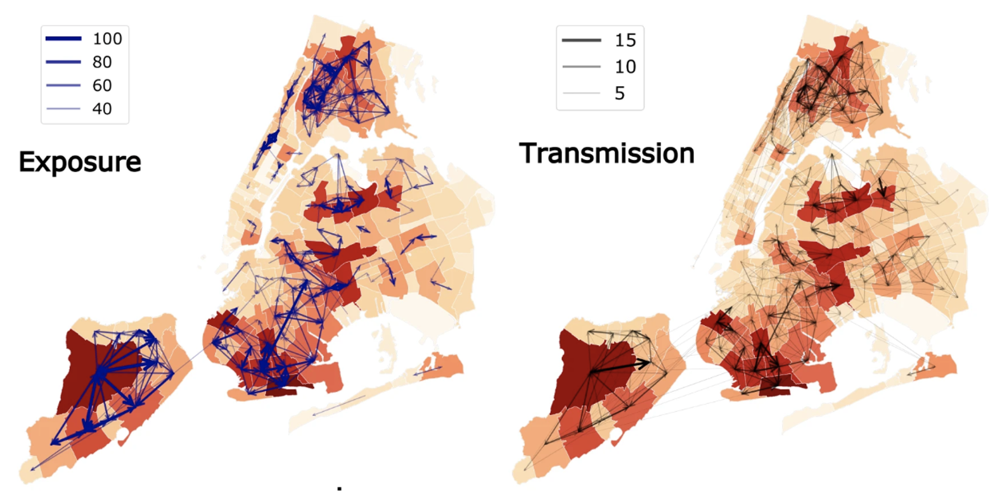

This is an item in your portfolio. It can be have images or nice text. If you name the file .md, it will be parsed as markdown. If you name the file .html, it will be parsed as HTML. 

<figure style="float: left; margin: 0 20px -10px 0;">
    
</figure>